

<a href="#reciped" title="jump to Reciped"></a> <a href="https://uschedule.ca/" title="open uschedule.ca"></a> <a href="#polybot" title="jump to Polybot"></a>
<a href="#netcode" title="jump to multiplayer netcode">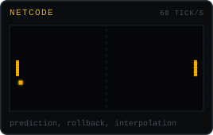</a> <a href="#software-factory" title="jump to Software Factory"></a> <a href="https://nav-canada-simulator.vercel.app" title="open the NAV Canada simulator"></a>

  

<a href="https://www.linkedin.com/in/julien-dewolfe/">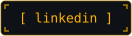</a>&nbsp;
<a href="https://uschedule.ca/"></a>

 

I'm Julien DeWolfe. I study software engineering at the University of Ottawa and work as a software engineer at [Gadget](https://gadget.dev), where I help build the platform that other people's apps run on. I started programming at nine by making games, and most of what I build still comes from the same place: realtime systems, multiplayer servers, and tools that save people real time.

## Projects

My current focus. A social recipe app: import a recipe from any website, keep your collection in one place, and share what you cook. One GraphQL API serves a Next.js web app and a Flutter mobile app, with recipe parsing handled by a local language model. The repo stays private until launch.

A timetable builder for uOttawa students, live at [uschedule.ca](https://uschedule.ca/). Pick your courses, set preferences like no morning classes or Fridays off, and it generates every conflict-free schedule and ranks them. Professor ratings and calendar export are built in.


A personal tool that turns AI agents into a small dev team. I describe work in a browser terminal, a manager agent splits it into tasks, worker agents write the code, a reviewer agent checks it, and the results come back to me as pull requests.

A lab for testing prediction market trading strategies on Polymarket. Six strategies run side by side, each in its own Docker container, all reporting to one live dashboard. Paper trading only: no wallet keys, no real orders, no real money.

An air traffic control simulator: 1,000 real Canadian flights moving across a 3D globe, with weather overlays and conflict scenarios you have to resolve before they become close calls. [Try it here](https://nav-canada-simulator.vercel.app).

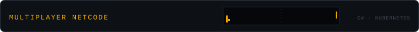

Multiplayer networking written from scratch in C#: client prediction, server reconciliation, and interpolation, so the game feels instant while the server stays in charge of the truth. Alongside it, a Kubernetes lab for running game servers that survive crashes and restarts.

Years of Minecraft server plugins in Java and Kotlin, including [Conway's Game of Life running inside Minecraft](https://github.com/OminousOne/NotchsGameOfLife), and [Tailor](https://github.com/OminousOne/Tailor), a tool for flashing operating systems to USB drives. This is where I learned to program.

## A year on GitHub

 

The heatmap and streaks come from my GitHub contribution calendar. The clock comes from the timestamps of 1,113 commits in the repos I am working on right now. The snake is just having lunch.

## My story


I got into programming at nine years old through Blender's node based game engine, because I wanted to make games and had no idea the thing I was wiring together was called logic. Nodes led to Unity and C#, and game jams led to the question that still drives most of my projects: how do you make software feel instant for people who are far apart?

For a few years most of my code ran on Minecraft servers. Writing plugins in Java and Kotlin for real players taught me more than any tutorial: things crash on a Saturday, someone always finds the edge case, and performance only matters once other people depend on you.

Today I study software engineering at the University of Ottawa and build the platform at Gadget that other developers ship their apps on. The throughline has not changed since I was nine: I like building systems with real users and real constraints, where making something feel effortless takes actual engineering.

 

every graphic on this page is a hand-built SVG, generated by <a href="./tools/build.py">tools/build.py</a> · refresh to replay

