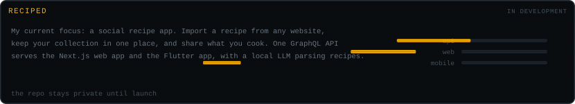
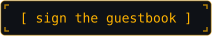

  
  

  

&nbsp;

 

I'm **Julien DeWolfe**, a Software Engineering student at the University of Ottawa who started making games using Blender's node-based engine at age 9. That turned into Unity, C#, game jams, networking rabbit holes, and eventually a fascination with systems and engineering in general. I'm currently an intern at [Gadget](https://gadget.dev) while studying Software Engineering at the University of Ottawa.

## Projects

 
 
 

Live: [uschedule.ca](https://uschedule.ca/) · [NAV Canada simulator](https://nav-canada-simulator.vercel.app).

## A year on GitHub

  

## Guestbook

 

