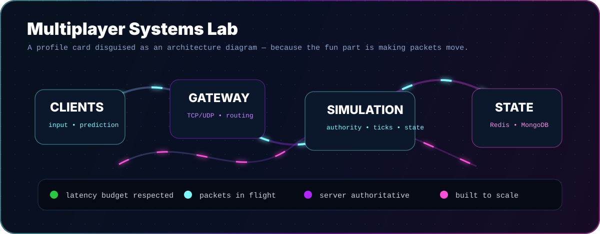

---

## The short version

I'm **Julien DeWolfe**, a Software Engineering student at the University of Ottawa who started making games in Blender's node-based engine at nine years old. That turned into Unity, C#, game jams, networking rabbit holes, and eventually a fascination with systems that have to stay fast when everything is happening at once.

I like building things where there is a real engine underneath the UI: multiplayer servers, scheduling tools, distributed infrastructure, realtime systems, and developer-facing products that feel polished instead of duct-taped together.

---

---

## Case files

<table>
<tr>
<td width="50%" valign="top">
<h3>🛰️ Distributed Game Server Lab</h3>

A Kubernetes-backed realtime game server experiment focused on scaling, failover, service boundaries, and the extremely fun problem of keeping game state sane across moving parts.

<strong>Interesting bits:</strong> load balancing, microservices, Redis/Mongo-backed state, CI/CD, fault tolerance.

</td>
<td width="50%" valign="top">
<h3>🎮 Server-Authoritative Multiplayer</h3>

Custom TCP/UDP networking in C# with client prediction, server reconciliation, and interpolation. The goal: make gameplay feel instant without letting clients lie to the server.

<strong>Interesting bits:</strong> tick loops, reconciliation, entity snapshots, latency hiding.

</td>
</tr>
<tr>
<td width="50%" valign="top">
<h3>📚 uOttawa Scheduler</h3>

A tool for helping uOttawa students create course schedules quickly without living inside tabs, PDFs, and spreadsheet chaos.

</td>
<td width="50%" valign="top">
<h3>🍽️ Delivery Management Prototype</h3>

A full-stack restaurant delivery management app with auth, order/menu APIs, and a component-driven frontend.

<strong>Interesting bits:</strong> Next.js, React, TypeScript, JWT auth, API design.

</td>
</tr>
</table>

---

---

## What I reach for when building

Not a giant wall of logos — just the tools that keep showing up in the work I enjoy most.

<table>
<tr>
<td width="33%" valign="top">
<h3>Game / realtime</h3>

<code>C#</code> <code>Unity</code> <code>TCP</code> <code>UDP</code> <code>Sockets</code> <code>Prediction</code> <code>Interpolation</code> <code>Server Authority</code>

</td>
<td width="33%" valign="top">
<h3>Web / product</h3>

<code>TypeScript</code> <code>React</code> <code>Next.js</code> <code>Node.js</code> <code>Tailwind</code> <code>REST APIs</code> <code>JWT</code>

</td>
<td width="33%" valign="top">
<h3>Systems / infra</h3>

<code>Docker</code> <code>Kubernetes</code> <code>Redis</code> <code>MongoDB</code> <code>Postgres</code> <code>Nginx</code> <code>GitHub Actions</code>

</td>
</tr>
</table>

---

## Signal from GitHub

---

<strong>🧪 How this README does the flashy stuff</strong>

 

The big panels above are **hand-written SVGs** in this repo, not screenshots:

- `assets/hero.svg` — neon profile card, animated scanline, packet paths, radar nodes, blinking terminal cursor
- `assets/network-lab.svg` — animated architecture diagram with flowing packet traces
- `assets/quest-console.svg` — animated skill/mission console

GitHub renders them like normal images, but the SVGs contain their own gradients, filters, and animations. Tiny profile easter egg: inspect the assets if you want to see the machinery.

---

<pre><code>if it involves realtime systems, weird edge cases, or making a tool feel 10x nicer — I'm interested.</code></pre>

