  

&nbsp;

 

I'm Julien DeWolfe. I study software engineering at the University of Ottawa and work as a software engineer at [Gadget](https://gadget.dev), where I help build the platform that other people's apps run on. I started programming at nine by making games, and most of what I build still comes from the same place: realtime systems, multiplayer servers, and tools that save people real time.

## Projects

My current focus. A social recipe app: import a recipe from any website, keep your collection in one place, and share what you cook. One GraphQL API serves a Next.js web app and a Flutter mobile app, with recipe parsing handled by a local language model. The repo stays private until launch.

A timetable builder for uOttawa students, live at [uschedule.ca](https://uschedule.ca/). Pick your courses, set preferences like no morning classes or Fridays off, and it generates every conflict-free schedule and ranks them. Professor ratings and calendar export are built in.

A personal tool that turns AI agents into a small dev team. I describe work in a browser terminal, a manager agent splits it into tasks, worker agents write the code, a reviewer agent checks it, and the results come back to me as pull requests.

A lab for testing prediction market trading strategies on Polymarket. Six strategies run side by side, each in its own Docker container, all reporting to one live dashboard. Paper trading only: no wallet keys, no real orders, no real money.

An air traffic control simulator: 1,000 real Canadian flights moving across a 3D globe, with weather overlays and conflict scenarios you have to resolve before they become close calls. [Try it here](https://nav-canada-simulator.vercel.app).

Multiplayer networking written from scratch in C#: client prediction, server reconciliation, and interpolation, so the game feels instant while the server stays in charge of the truth. Alongside it, a Kubernetes lab for running game servers that survive crashes and restarts.

Years of Minecraft server plugins in Java and Kotlin, including [Conway's Game of Life running inside Minecraft](https://github.com/OminousOne/NotchsGameOfLife), and [Tailor](https://github.com/OminousOne/Tailor), a tool for flashing operating systems to USB drives. This is where I learned to program.

## A year on GitHub

 

every graphic on this page is a hand-built SVG, generated by <a href="./tools/build.py">tools/build.py</a> · refresh to replay

